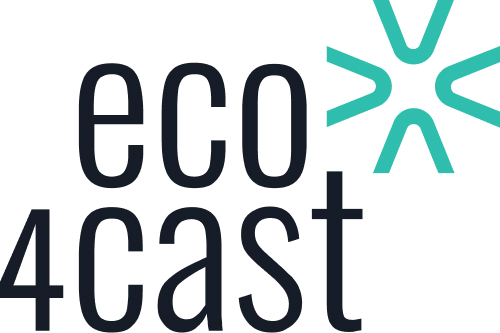

# eco4cast

[](https://colab.research.google.com/github/AIRI-Institute/eco4cast/blob/main/examples/eco4cast_demo/quick_start_guide.ipynb)

+ [About eco4cast :clipboard:](#1)
+ [Installation :wrench:](#2)
+ [Usage examples :computer:](#3)
+ [Citing](#4)
<!-- + [Feedback :envelope:](#6)  -->


## About eco4cast :clipboard: <a name="1"></a> 



The package eco4cast is designed to reduce CO2 emissions while training neural network models. The main idea of the package is to run the learning process at certain time intervals on certain Google Cloud servers with minimal emissions. A neural network (TCN) trained on the historical data of 13 zones is used to predict emissions for 24 hours ahead.

Currently supported Google Cloud zones: 'southamerica-east1-b', 'northamerica-northeast2-b', 'europe-west6-b', 'europe-west3-b', 'europe-central2-b', 'europe-west1-b', 'europe-west8-a', 'northamerica-northeast1-b', 'europe-southwest1-c', 'europe-west2-b', 'europe-north1-b', 'europe-west9-b',  'europe-west4-b' .

## Installation <a name="2"></a> 
Package can be installed using Pypi:
```
pip install eco4cast
```

## Usage examples <a name="3"></a> 
There are several usage examples you can use to start working with eco4cast package. They are listed in [examples folder](https://github.com/AIRI-Institute/eco4cast/tree/main/examples). 

### Example of using eco4cast with Google Cloud
You can use eco4cast to reduce your carbon footprint with the help of Google Cloud virtual machines and moving between zones to reach minimal emission coefficient. In this Colab notebook you can find step-by-step tutorial on setting up your first training process using eco4cast and Google Cloud [](https://colab.research.google.com/github/AIRI-Institute/eco4cast/blob/main/examples/eco4cast_demo/quick_start_guide.ipynb)

### Example of using eco4cast locally
You can use eco4cast to reduce your carbon footprint by training during times with minimal emission in your region. In this Colab notebook you can find step-by-step guide on starting training locally [](https://colab.research.google.com/github/AIRI-Institute/eco4cast/blob/main/examples/eco4cast_local_demo/local_quick_start_guide.ipynb). 

Available electricitymaps zones to work locally: 
"BR-CS" (Central Brazil), "CA-ON" (Canada Ontario) , "CH" (Switzerland), "DE" (Germany),
"PL" (Poland), "BE" (Belgium), "IT-NO" (North Italy), "CA-QC" (Canada Quebec), "ES" (Spain), 
"GB" (Great Britain), "FI" (Finland), "FR" (France) "NL" (Netherlands)

## Citing <a name="4"></a>

[](https://doi.org/10.1134/S1064562422060230)

The Eco4cast is licensed under a [Apache licence 2.0](https://www.apache.org/licenses/LICENSE-2.0).

Please consider citing the following paper in any research manuscript using the Eco4cast library:

```
 @article{eco4cast,
 title={eco4cast: Bridging Predictive Scheduling and Cloud Computing for Reduction of Carbon Emissions for ML Models Training},
 volume={108},
 DOI={10.1134/S1064562423701223},
 number={2},
 journal={Doklady Mathematics}, author={Tiutiulnikov, M. and Lazarev, V. and Korovin, A. and Zakharenko, N. and Doroshchenko, I. and Budennyy, S.},
 year={2023}, month=dec, pages={S443–S455}, language={en}}

```

<!-- ## Feedback <a name="6"></a>
email? -->
